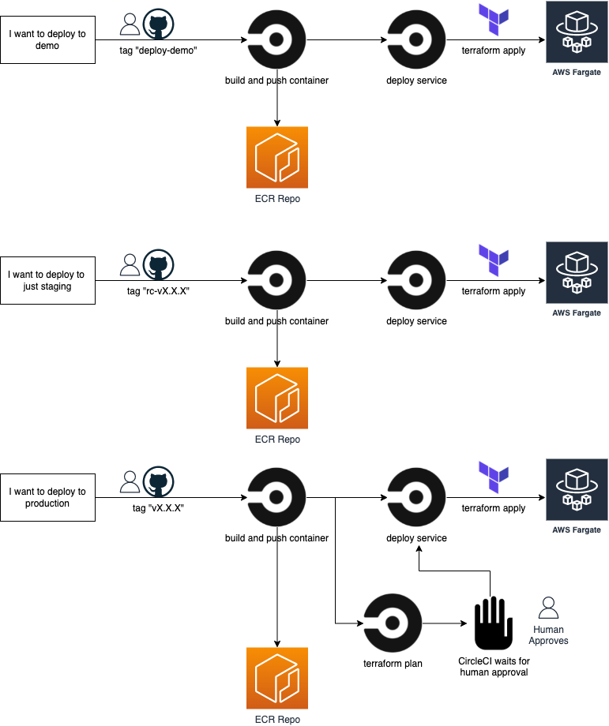

# HUBZone Map

This application houses the new and improved HUBZone Map for the Small Business Administration.  All development is currently being done off of the `develop` (default) branch.

### Table of Contents

- [Local Development](#local-development)
  - [Software](#software)
  - [Building](#building)
  - [Local Deployment](#local-deployment)
- [Additional Configuration](#additional-configuration)
- [Testing](#testing)
- [External Services](#external-services)
- [CircleCI Deployment](#circleci-deployment)
- [Directories](#directories)
- [Changelog](#changelog)
- [License](#license)
- [Contributing](#contributing)
- [Security Issues](#security-issues)

## Local Development

### Software

For development and local development you will need to install the following on your computer:
* [RVM](http://rvm.io/)
* Ruby 2.7.4
  - `rvm install 2.7.4`
* Bundler
  - `rvm @global do gem install bundler`
  - Tested with version 2.0.0 or later
* PhantomJS 2.1.1, or newer (required for Capybara tests with Poltergeist)
  * Mac
    * `brew install phantomjs`
  * Linux
    * [download this tarball](https://bitbucket.org/ariya/phantomjs/downloads/phantomjs-1.9.8-linux-x86_64.tar.bz2)
    * Extract the tarball and copy `bin/phantomjs` into your `PATH`
* PostgreSQL 12
  * Mac
    - Use [Postgres.app](http://postgresapp.com/)
    - Can also use `brew install postgresql-12`
    - Set `PGSQL_HOME` to your installation dir
      - e.g. `export PGSQL_HOME=/Applications/Postgres.app/Contents/Versions/12`
    - Ensure that the bin directory is in your path
      - e.g. `export PATH=${PATH}:${PGSQL_HOME}/bin`
* Docker (multiplatform)
  * [docker docs](https://docs.docker.com/get-docker/)
      - [centos/redhat installation](https://docs.docker.com/engine/install/centos/)
      - [ubuntu installation](https://docs.docker.com/engine/install/ubuntu/)
      - [debian installation](https://docs.docker.com/engine/install/debian/)
  * [docker-compose](https://docs.docker.com/compose/install/)
  * Run: `docker-compose -f ./docker-compose.postgres.yml up -d`
  * Default user/pass is "postgres"/"postgres"

### Building

After cloning the repo, checkout out the `develop` branch and set up your environment:
```
git checkout develop
cp example.env .env
# edit .env to provide your postgresql user/password and, if necessary, override any defaults
```

Then run the following:
``` bash
bundle install
bundle exec rake db:create db:migrate
```

If the `bundle install` fails due to the pg gem, make sure you have the ENV vars above set in your shell.

### Local Deployment

To launch the map:
``` bash
rails server
```
Then point your browser to http://localhost:3000/

Note: for the map to "work", you will need to have the Hubzone API and an instance of  GeoServer running as well.  See the README in the [hubzone-api](https://github.com/USSBA/hubzone-api) repository for details.

## Additional configuration

Must connect to a GeoServer instance to produce map tiles
  - http://geoserver.org/

## Testing

### Rspec Tests

To run the test suite, simply run:
```
rspec
```

or with verbose output:
```
rspec -f d
```

To view the coverage report, open
```
coverage/index.html
```

### Rubocop

```
rubocop -D
```

### Javascript Tests

#### Teaspoon / Jasmine / Istanbul Unit and Coverage tests

Teaspoon is used for Javascript testing and coverage.  It runs Jasmine for unit and integration tests and Istanbul for test coverage.

First install Istanbul:
```
npm install -g istanbul
```

To run Teaspoon for unit tests, run:
```
bundle exec teaspoon
```

To include Istanbul coverage tests, run:
```
bundle exec teaspoon --coverage=default
```

To view interactive report of test coverage, open:
```
coverage/default/index.html
```

To view live version of Teaspoon tests
```
localhost:3000/teaspoon
```

#### JSHint Lint Tests

Using this JSHint gem [JSHint](https://github.com/damian/jshint), per its docs:

Add `gem 'jshint'` to the Gemfile under `group :development, :test`

Run `bundle` to install, then run `bundle exec rake jshint` to run test.

## External services

- Connect to [Google Map API](https://developers.google.com/maps/) by putting your key in the .env file
- Connect to [Google Analytics](https://www.google.com/analytics/analytics/features/) by putting your key in the .env file

## CircleCI Deployment

Code deployment is handled by CircleCI. The project can be viewed on [USSBA's CircleCI dashboard](https://circleci.com/gh/USSBA/hubzone-webmap).

The CircleCI config file is located at .circleci/config.yml. For more on CircleCI configuration see their configuration reference.

### Pre-requisites

CircleCI utilizes GitHub permissions per repo. In order to trigger a CircleCI build your GitHub user will need the correct permissions.

Knowledge of CircleCI is supremely helpful. See the [CircleCI documentation](https://circleci.com/docs/) for help.

### Deployment workflows

Builds for this project are triggered by commits to branches or by creating git tags. This will trigger a CircleCI workflow that runs a series of jobs which are defined in the project's CircleCI config file. To see the different workflows and jobs look at the respective codeblocks in `.circleci/config.yml`.

For more on workflows and jobs, see the [CircleCI workflow documentation](https://circleci.com/docs/2.0/workflows/).



### Actions on all branches

A commit on any branch will trigger the `test` workflow:

* rubocop: Used for linting (code analyzer and formatter).
* rspec / rspec-docker: Used for behavior driven development.
* teaspoonJS: A JavaScript test runner built for Rails. Used for running tests in the browser and headless using PhantomJS, or Selenium WebDriver.
* jsHint: Used for static code analysis.
* brakeman: Vulnerability scanner specifically designed for Ruby on Rails applications. It statically analyzes Rails application
* build-containers: Builds the containers but does not push them. This is a test to confirm containers build properly.
* test-terraform-validate: Runs a `terraform validate` to ensure the configuration files in a directory are valid.
* test-terraform-format: Runs a `terraform fmt` to ensure the configuration files are in a canonical format and style.

### Tag based build

To trigger a build workflow for testing the docker build process, the following git tags can be used. This can come in hand if you want to make sure the container can still be built after changes that were made without also performing a deploy.

* `build-lower`
* `build-upper`

These tags must be force tagged/pushed to overwrite previous tags.

Example:
```sh
git tag build-lower --force && git push origin tags/build-lower --force
```

### Tag based deployment

To trigger a build/deploy workflow for a specific environment, the following git tags can be used for their respective environments:

* Demo -> `deploy-demo`
* Stg -> `rc-vX.X.X`
* Prod -> `vX.X.X`

Demo Example:
```sh
git tag deploy-demo --force && git push origin deploy-demo --force
```

Stg Example:
```sh
git tag rc-v1.0.0 && git push origin rc-v1.0.0
```

Prod Example:
```sh
git tag v1.0.0 && git push origin v1.0.0
```

### Archive deployment

To implement changes to the Archive Map, you will need to work off the `archive-map` branch (as opposed to `develop` or `master`).

To trigger a build/deploy workflow for a specific environment to the archive map, use the following git tags for their respective environment:

* Demo -> `deploy-archive-demo`
* Stg -> `deploy-archive-stg`
* Prod -> `deploy-archive-prod`

Demo Example:
```sh
git tag deploy-archive-demo --force && git push origin deploy-archive-demo --force
```

Stg Example:
```sh
git tag deploy-archive-stg --force && git push origin deploy-archive-stg --force
```

Prod Example:
```sh
git tag deploy-archive-prod --force && git push origin deploy-archive-prod --force
```

## Directories

Information regarding directories and files.

Root(./): Root directory of this repository contains Docker files needed for HUBZone Webmap along with docker-compose for local development.

terraform: Infrastructure code to deploy HUBZone Webmap.
  - fargate.tf: Contains code that is used to deploy the container to AWS Fargate.
  - infrastructure-resources.tf: Contains data calls that gets AWS resources which are used by `fargate.tf`.
  - locals.tf: Contains local environment variables that can be commonly shared between all Terraform files.
  - main.tf: Contains Terraform backend provider resources.
  - cloudfront.tf: Contains the CloudFront distribution and relative resources like Route53 records.

.circleci: Contains CircleCI pipeline yml.

## Changelog

Refer to the changelog for details on API updates. [CHANGELOG](CHANGELOG.md)

## License

The HUBZone-WebMap is licensed permissively under the Apache License v2.0.
A copy of that license is distributed with this software.

This project may use Google APIs. The Google API are licensed under their Google API's [terms and conditions](https://developers.google.com/maps/terms).

## Contributing

We welcome contributions. Please read [CONTRIBUTING](CONTRIBUTING.md) for how to contribute.

We strive for a welcoming and inclusive environment for the HUBZone-WebMap project.

Please follow this guidelines in all interactions:

1. Be Respectful: use welcoming and inclusive language.
2. Assume best intentions: seek to understand other's opinions.

## Security Issues

Please do not submit an issue on GitHub for a security vulnerability. Please contact the development team through the Certify Help Desk at [help@certify.sba.gov](mailto:help@certify.sba.gov).

Be sure to include all the pertinent information.

<sub>The agency reserves the right to change this policy at any time.</sub>
